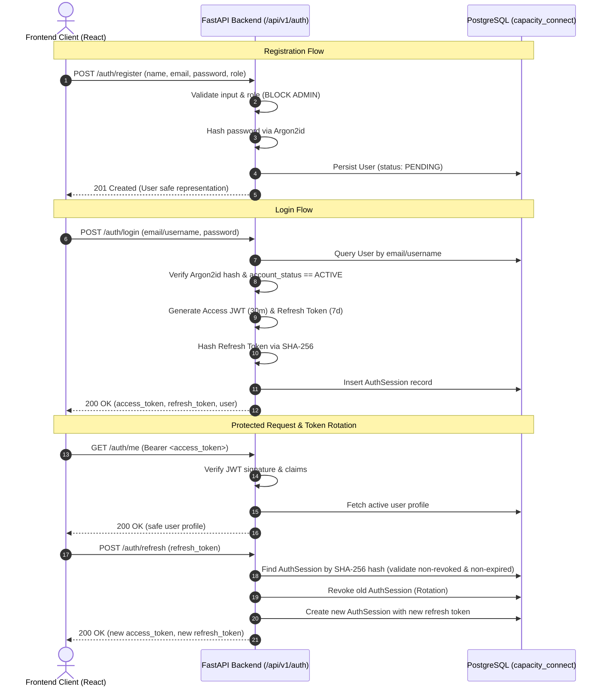

# Capacity Connect — Authentication, Security & RBAC Architecture

**Document Version:** 1.0  
**Phase:** Phase 2 (Authentication, Security & RBAC)  
**System:** Capacity Connect — IMD Digital Capacity Building & Learning Management Portal  

---

## 1. Authentication Architecture

Capacity Connect implements a modern, stateless-first, token-based authentication architecture with server-persisted session revocation capabilities. The architecture conforms strictly to a ₹0-cost mandate by utilizing open-source libraries (`FastAPI`, `argon2-cffi`, `pyjwt`, `SQLAlchemy`, `PostgreSQL`) without reliance on commercial or externally metered identity-as-a-service providers (such as Auth0, Clerk, or AWS Cognito).



---

## 2. Password Hashing (Argon2id)

Passphrases are hashed exclusively using the **Argon2id** algorithm, the winner of the Password Hashing Competition (PHC) and the gold standard for memory-hard, side-channel-resistant password hashing.

- **Library**: `argon2-cffi`
- **Algorithm**: Argon2id (hybrid variant combining Argon2d resistance against GPU cracking and Argon2i resistance against side-channel cache attacks)
- **Work Parameters**:
  - Time Cost (`time_cost`): 3 iterations
  - Memory Cost (`memory_cost`): 65,536 KiB (64 MiB)
  - Parallelism (`parallelism`): 4 threads
- **Plaintext Safeguards**: Plaintext passwords are never persisted to any table, never cached, never returned in API responses, and never printed to server logs.
- **Validation Constraints**:
  - Minimum length: 8 characters
  - Maximum length: 128 characters
  - Complexity: Must contain at least one digit and one letter
  - Confirmation: Registration and reset workflows enforce byte-for-byte confirmation matching.

---

## 3. JWT Architecture

Stateless authorization for protected endpoints is mediated via JSON Web Tokens (JWT).

- **Library**: `pyjwt` with cryptographic signature verification.
- **Signature Algorithm**: HMAC with SHA-256 (`HS256`).
- **Secret Key**: Configured via `JWT_SECRET_KEY` environment variable. Defaults to high-entropy secrets in development; strictly validated in production.
- **Access Token Lifetime**: 30 minutes (`ACCESS_TOKEN_EXPIRE_MINUTES = 30`).
- **Token Claims Payload**:
  ```json
  {
    "sub": "<user_uuid>",
    "role": "TRAINEE" | "TRAINER" | "ADMIN",
    "email": "user@imd.gov.in",
    "name": "Dr. User",
    "type": "access",
    "jti": "<secure_random_uuid>",
    "iat": 1740000000,
    "exp": 1740001800
  }
  ```
- **Claim Minimization**: Personally identifiable credentials, password hashes, and internal database foreign keys are strictly excluded from JWT claims.

---

## 4. Refresh Session Architecture (`auth_sessions`)

To prevent persistent credential vulnerabilities and allow instant server-side revocation, refresh tokens are governed through database-persisted sessions.

### Schema Details (`auth_sessions` table)
| Column | Type | Description |
|---|---|---|
| `id` | `UUID` (PK) | Unique session identifier |
| `user_id` | `UUID` (FK) | Cascade link to `users.id` |
| `token_hash` | `VARCHAR(64)` | Cryptographic SHA-256 hash of the issued refresh token (raw token is never stored) |
| `user_agent` | `VARCHAR(500)` | Client browser/device user-agent string |
| `ip_address` | `VARCHAR(45)` | IPv4 / IPv6 client network origin |
| `expires_at` | `TIMESTAMPTZ` | Session expiry timestamp (default 7 days) |
| `revoked_at` | `TIMESTAMPTZ` | Revocation timestamp; null indicates active session |
| `last_used_at`| `TIMESTAMPTZ` | Updated on each successful token refresh |
| `created_at` | `TIMESTAMPTZ` | Session creation timestamp |

### Token Rotation
Upon every call to `POST /api/v1/auth/refresh`:
1. The incoming refresh token is hashed via SHA-256 and queried in `auth_sessions`.
2. The session is verified: `revoked_at IS NULL` and `expires_at > UTC_NOW()`.
3. The underlying user account is re-checked to confirm `account_status == 'ACTIVE'`.
4. The existing session is marked as revoked (`revoked_at = UTC_NOW()`).
5. A brand-new refresh token and session record are created, rotated, and returned to the client along with a fresh access token.

---

## 5. Role-Based Access Control (RBAC)

RBAC is strictly enforced at the backend gateway level using FastAPI dependency injection.

### Hierarchy & Role Definitions
1. **`TRAINEE`**:
   - Access to personal profile, enrolled courses, learning resources, assessments, feedback, and personal competency radar.
   - Strictly forbidden from viewing trainer grading dashboards or admin configuration.
2. **`TRAINER`**:
   - Access to authored courses, batch rosters, assessment bank creation, submission grading, and trainer recommendations.
   - Forbidden from global system configuration or user account management.
3. **`ADMIN`**:
   - Full governance over user account lifecycle (approvals, suspensions, activations), platform taxonomies, organizational departments, and institutional analytics.

### Declarative Dependency Primitives
- `get_current_user`: Extracts, validates, and decodes Bearer JWT; fetches user from database; validates account existence.
- `get_current_active_user`: Validates that `account_status == 'ACTIVE'` and `is_active is True`.
- `require_role(role_name)`: Returns a dependency validating that the caller holds the exact specified role or raises `403 Forbidden`.
- `require_roles([role_a, role_b])`: Returns a dependency authorizing any role in the permitted set.

---

## 6. Registration Flow

- **Endpoint**: `POST /api/v1/auth/register`
- **Request Payload**:
  ```json
  {
    "email": "officer@imd.gov.in",
    "password": "Password123!",
    "confirm_password": "Password123!",
    "name": "Sanjay Sharma",
    "username": "sanjay_sharma",
    "role": "TRAINEE"
  }
  ```
- **Role Assignment Security**:
  - The public registration endpoint explicitly forbids self-registration as `ADMIN`.
  - Attempts to register with `role: "ADMIN"` are rejected with `400 Bad Request`.
  - Permitted public roles: `TRAINEE` (default) and `TRAINER`.
- **Account State Assignment**:
  - Accounts are initialized in the `PENDING` state when `REQUIRE_ADMIN_APPROVAL=True`.
  - A secure verification token is generated, hashed, and stored on the user record.
  - Safe response returned with message informing the user that their account is pending administrative approval.

---

## 7. Email Verification Architecture

- **Endpoint**: `POST /api/v1/auth/verify-email`
- **Zero-Cost Strategy**:
  - Eliminates reliance on paid transactional email services (SendGrid, Mailgun, AWS SES).
  - Tokens are generated using Python's `secrets.token_urlsafe(32)`.
  - The single-use verification token is stored as a SHA-256 hash in `users.verification_token_hash` with an expiration timestamp (`users.verification_token_expires_at`, 24 hours).
  - In development environments (`DEBUG=True`), the verification URL is logged to stdout for testing.
  - In production, email sending can interface with a standard self-hosted SMTP server without paid API overhead.
- **Verification Execution**:
  - Validates token hash match and expiration.
  - Sets `is_verified = True`.
  - Clears `verification_token_hash` and `verification_token_expires_at` to prevent replay attacks.

---

## 8. Password Reset Flow

- **Request Endpoint**: `POST /api/v1/auth/forgot-password`
  - Input: `{"email": "user@imd.gov.in"}`
  - **Account Enumeration Defense**: Always returns a generic safe message: *"If an account with that email exists, a password reset link has been generated."* regardless of whether the email is present in the database.
  - Single-use reset token generated, hashed via SHA-256, and stored with a 1-hour expiration timestamp (`users.reset_token_hash`, `users.reset_token_expires_at`).
- **Reset Execution Endpoint**: `POST /api/v1/auth/reset-password`
  - Input: `{"token": "<reset_token>", "new_password": "NewSecret123!", "confirm_password": "NewSecret123!"}`
  - Validates token existence, expiration, and complexity of `new_password`.
  - Updates `password_hash` with a fresh Argon2id hash.
  - Clears token hash fields.
  - Revokes all existing user authentication sessions in `auth_sessions` to terminate compromised devices.

---

## 9. Admin User Lifecycle & Approval Architecture

- **Endpoints**:
  - `GET /api/v1/admin/users/pending`: Lists all users awaiting verification/approval.
  - `POST /api/v1/admin/users/{user_id}/approve`: Sets status to `ACTIVE`, enabling portal login.
  - `POST /api/v1/admin/users/{user_id}/reject`: Sets status to `REJECTED`, blocking future logins.
  - `POST /api/v1/admin/users/{user_id}/suspend`: Sets status to `SUSPENDED` and immediately revokes all active auth sessions.
  - `POST /api/v1/admin/users/{user_id}/activate`: Restores account status to `ACTIVE`.
- **Security Check**:
  - All admin endpoints are guarded by `Depends(require_role("ADMIN"))`.
  - Non-admin requests receive HTTP `403 Forbidden`.

---

## 10. Logout & Session Revocation

- **Current Device Logout (`POST /api/v1/auth/logout`)**:
  - Accepts `{"refresh_token": "..."}`.
  - Hashes the token and marks the matching `auth_sessions` record as `revoked_at = UTC_NOW()`.
- **Global Logout (`POST /api/v1/auth/logout-all`)**:
  - Requires authenticated Bearer access token.
  - Sets `revoked_at = UTC_NOW()` on all active sessions associated with the caller's `user_id`.
  - Immediately terminates access across all browsers and devices.

---

## 11. Security Considerations & Defenses

1. **Privilege Escalation Prevention**: Role assignment during registration is strictly validated. The `Role` enum cannot be manipulated by untrusted client payloads.
2. **Account Enumeration Mitigation**: Forgot-password responses return identical success-status messages for registered and unregistered emails.
3. **Token Replay Mitigation**: Verification tokens and password reset tokens are single-use; the cryptographic hash is cleared immediately upon successful invocation.
4. **Credential Confidentiality**: Database models use explicit Pydantic response models (`UserResponse`) that exclude `password_hash`, `reset_token_hash`, and internal security tokens.
5. **Session Hijacking Mitigation**: Refresh tokens stored in the database are one-way hashed with SHA-256. A compromised database backup will not reveal valid refresh tokens.
6. **CORS Governance**: Configured via `CORS_ORIGINS` to accept requests only from designated frontend origins (`http://localhost:5173`, etc.).

---

## 12. Environment Variables

| Variable | Type | Default | Description |
|---|---|---|---|
| `JWT_SECRET_KEY` | String | (Dev secret) | Cryptographic signing key for HMAC SHA-256 JWTs |
| `ACCESS_TOKEN_EXPIRE_MINUTES` | Integer | `30` | Access token lifespan in minutes |
| `REFRESH_TOKEN_EXPIRE_DAYS` | Integer | `7` | Refresh token lifespan in days |
| `REQUIRE_ADMIN_APPROVAL` | Boolean | `True` | Whether newly registered accounts require admin activation |
| `DATABASE_URL` | String | `postgresql+psycopg2://...` | Connection URI to PostgreSQL database |
| `DEBUG` | Boolean | `True` | Development mode flag; controls safe token logging |

---

## 13. Development vs. Production Considerations

- **Secret Keys**: In production, `JWT_SECRET_KEY` must be injected as a 256-bit cryptographically secure random string (e.g. `openssl rand -hex 32`).
- **HTTPS Enforcement**: In production, cookies and Bearer tokens must be transmitted exclusively over TLS 1.3 / HTTPS.
- **SMTP Integration**: In development, email tokens are surfaced in terminal logs. In production, an internal government or institutional SMTP server is configured.

---

## 14. ₹0-Cost Architecture Decisions

Every component of Phase 2 was chosen to incur zero infrastructure or subscription expenses:
- **Authentication**: Custom FastAPI + Argon2id + PyJWT instead of Auth0 ($35+/mo) or Clerk ($25+/mo).
- **Session Store**: PostgreSQL relational table (`auth_sessions`) leveraging existing index infrastructure instead of a paid managed Redis instance.
- **Email Delivery**: Verification token hashing with developer console URL output and standard SMTP compatibility, eliminating third-party mail API fees.
- **UI Componentry**: Tailwind CSS + custom shadcn/ui primitives + Lucide React + Framer Motion instead of paid UI design templates.

---

## 15. Known Limitations & Future Enhancements

1. **In-Memory Rate Limiting**: The current rate limiting relies on standard database verification constraints and token expiration. In Phase 9, an optional in-memory or Redis-backed sliding-window rate limiter will be evaluated for high-throughput edge protection.
2. **Multi-Factor Authentication (MFA/TOTP)**: The underlying database schema is designed to accommodate TOTP secrets in future security hardening phases.
3. **Session Geolocation**: IP addresses are recorded; geolocation enrichment (country/city display in session tables) can be added using free MaxMind GeoLite2 databases.
