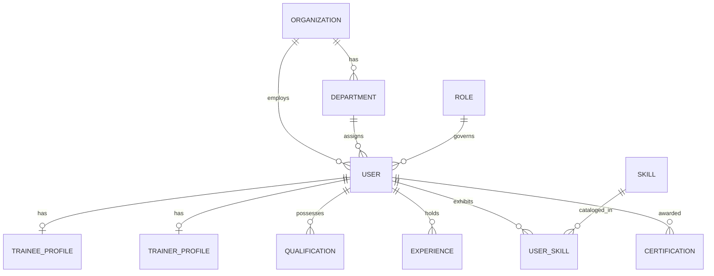
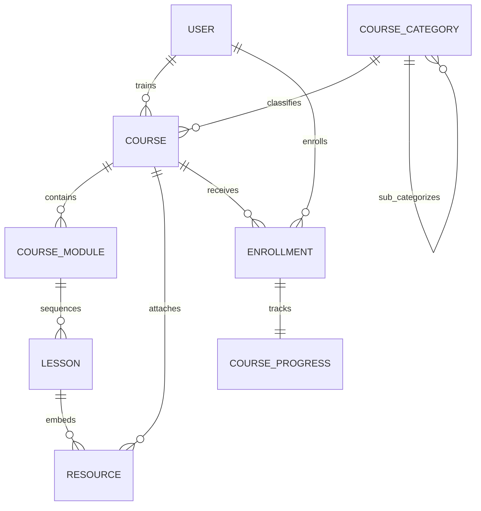
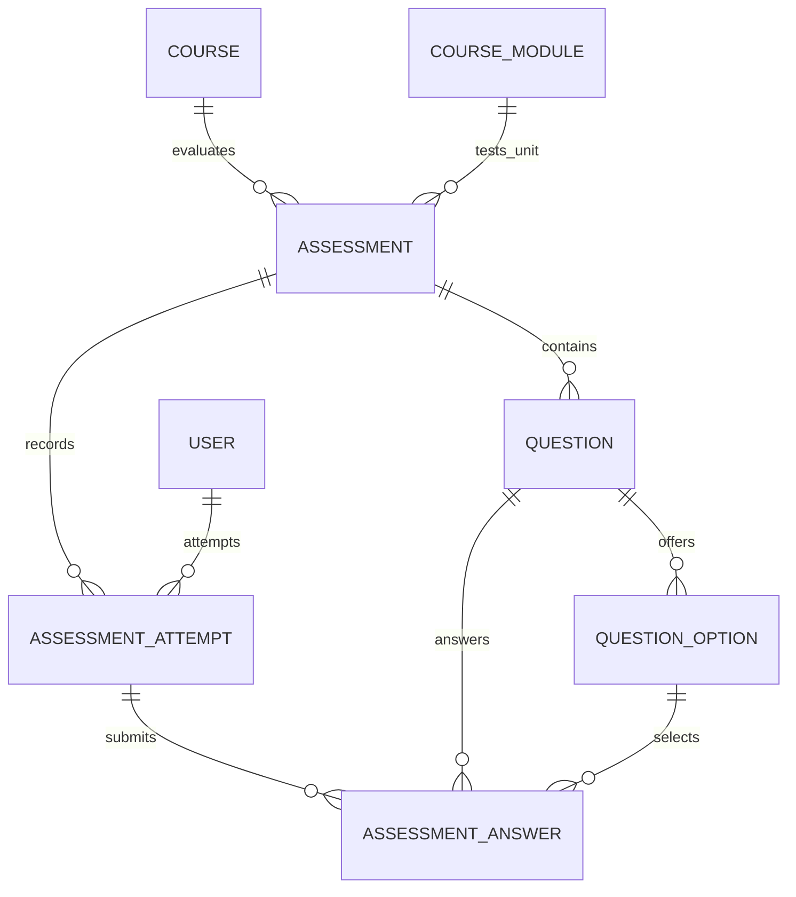
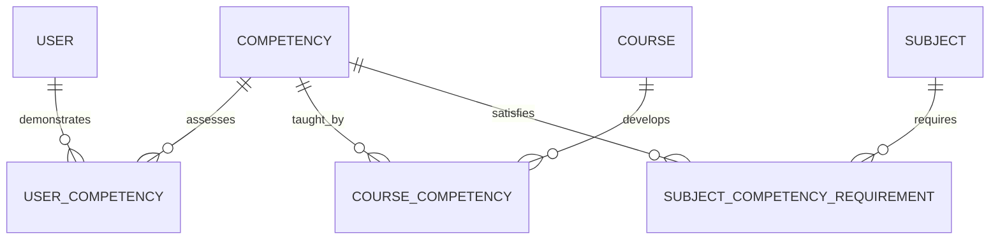

# CAPACITY CONNECT — DATABASE SCHEMA SPECIFICATION
### Relational Data Architecture & Entity Relationship Blueprint
**Version:** Phase 1 (Initial Schema Revision: `0001`)  
**Engine:** PostgreSQL 16+ (Supabase compatible) | **ORM:** SQLAlchemy 2.0 | **Migration:** Alembic

---

## 1. Database Architecture Overview

The Capacity Connect persistence layer is built on PostgreSQL with strict relational integrity, UUID primary keys across all domain entities, timezone-aware UTC timestamps, foreign key cascades, and composite uniqueness constraints.

The schema is structured to support the core closed-loop organizational readiness lifecycle:
```
Organization / Department
          ↓
  User (Trainee / Trainer / Admin)
          ├── Profile (TraineeProfile / TrainerProfile)
          ├── Qualifications & Experiences
          ├── Skills (Catalog & UserSkill)
          ├── Certifications
          │
          └── Courses & Modules & Lessons & Resources
                    ↕ (Enrollment & Progress)
                    ↓
                Assessments & Questions & Options & Attempts & Answers
                    ↓
                Competencies (Competency & UserCompetency & CourseCompetency)
                    ↕
                Subjects & SubjectCompetencyRequirements (Recommendation Engine)
                    ↕
                Evaluation Feedback (Course & Trainer)
```

---

## 2. Complete Entity Inventory (29 Entities)

| # | Entity Name | Table Name | Category | Primary Key | Description |
|---|---|---|---|---|---|
| 1 | `Organization` | `organizations` | Org & Users | UUID | Apex organization/cadre (e.g. IMD, MoES) |
| 2 | `Department` | `departments` | Org & Users | UUID | Operational division or regional meteorological centre |
| 3 | `Role` | `roles` | Org & Users | UUID | System RBAC role (`TRAINEE`, `TRAINER`, `ADMIN`) |
| 4 | `User` | `users` | Org & Users | UUID | Core identity actor |
| 5 | `TraineeProfile` | `trainee_profiles` | Org & Users | UUID | Trainee profile, cadre, posting location, readiness index |
| 6 | `TrainerProfile` | `trainer_profiles` | Org & Users | UUID | Trainer profile, specialization, rating, workload capacity |
| 7 | `Qualification` | `qualifications` | Org & Users | UUID | Academic degrees and professional credentials |
| 8 | `Experience` | `experiences` | Org & Users | UUID | Operational experience and posting history |
| 9 | `Skill` | `skills` | Org & Users | UUID | Master catalog of discrete technical/domain skills |
| 10 | `UserSkill` | `user_skills` | Org & Users | UUID | User-skill mapping with verified proficiency levels |
| 11 | `Certification` | `certifications` | Org & Users | UUID | Internal course certificates and external credentials |
| 12 | `CourseCategory` | `course_categories` | Course & LMS | UUID | Taxonomy classification for curriculum |
| 13 | `Course` | `courses` | Course & LMS | UUID | Course master record (curriculum, metadata, lifecycle) |
| 14 | `CourseModule` | `course_modules` | Course & LMS | UUID | Thematic module/unit within course syllabus |
| 15 | `Lesson` | `lessons` | Course & LMS | UUID | Instructional unit containing media, text, or interactive tasks |
| 16 | `Resource` | `resources` | Course & LMS | UUID | File metadata (PDF, PPT, video) stored in Supabase Storage |
| 17 | `Enrollment` | `enrollments` | Course & LMS | UUID | Trainee course enrollment and completion lifecycle |
| 18 | `CourseProgress` | `course_progress` | Course & LMS | UUID | Granular lesson progression, % completion, telemetry |
| 19 | `Assessment` | `assessments` | Assessment | UUID | Examination/assessment header (MCQ, practical, rubric) |
| 20 | `Question` | `questions` | Assessment | UUID | Question bank item with marks and explanations |
| 21 | `QuestionOption` | `question_options` | Assessment | UUID | Multiple choice answer options with correctness flag |
| 22 | `AssessmentAttempt` | `assessment_attempts` | Assessment | UUID | Trainee exam sitting, score, and evaluation status |
| 23 | `AssessmentAnswer` | `assessment_answers` | Assessment | UUID | Individual question response submitted by trainee |
| 24 | `Feedback` | `feedbacks` | Feedback | UUID | Multi-dimensional rating (course, trainer, content) |
| 25 | `Competency` | `competencies` | Competency | UUID | Standardized organizational competency rubric |
| 26 | `UserCompetency` | `user_competencies` | Competency | UUID | Trainee/trainer evaluated competency level & evidence |
| 27 | `CourseCompetency` | `course_competencies` | Competency | UUID | Course contribution weight toward competency level |
| 28 | `Subject` | `subjects` | Recommendation | UUID | Subject matter domain requiring trainer expertise |
| 29 | `SubjectCompetencyRequirement` | `subject_competency_requirements` | Recommendation | UUID | Competency benchmarks required for trainer suitability |

---

## 3. Entity Relationships & Schemas

### 3.1 Organization & User Management


### 3.2 Course & Content Hierarchy


### 3.3 Assessment Hierarchy


### 3.4 Competency & Recommendation Network


---

## 4. Key Constraints & Business Rules

### 4.1 Unique Constraints
1. `users.email` — Unique per user.
2. `users.username` — Unique system handle.
3. `roles.name` — Unique role identifier (`TRAINEE`, `TRAINER`, `ADMIN`).
4. `organizations.code` & `organizations.name` — Unique institution identifiers.
5. `uq_department_org_code`: `(organization_id, code)` — Department code unique within an organization.
6. `uq_user_skill`: `(user_id, skill_id)` — Prevents duplicate skill mappings for a user.
7. `uq_course_module_order`: `(course_id, order_index)` — Enforces unique sequence ordering for modules.
8. `uq_module_lesson_order`: `(module_id, order_index)` — Enforces unique sequence ordering for lessons.
9. `uq_user_course_enrollment`: `(user_id, course_id)` — Prevents duplicate enrollments in the same course.
10. `uq_question_option_order`: `(question_id, order_index)` — Enforces sequence order for MCQ options.
11. `uq_user_assessment_attempt`: `(assessment_id, user_id, attempt_number)` — Enforces sequence of attempt numbers.
12. `uq_attempt_question_answer`: `(attempt_id, question_id)` — One response per question per attempt.
13. `uq_user_competency`: `(user_id, competency_id)` — One competency ledger entry per user.
14. `uq_course_competency`: `(course_id, competency_id)` — Prevents duplicate competency mapping per course.
15. `uq_subject_competency_req`: `(subject_id, competency_id)` — Prevents duplicate competency requirements per subject.

### 4.2 Check Constraints
1. `chk_user_comp_level_range`: `current_level BETWEEN 1 AND 5`.
2. `chk_user_comp_confidence_range`: `confidence_score BETWEEN 0.0 AND 1.0`.
3. `chk_course_comp_target_level`: `target_level BETWEEN 1 AND 5`.
4. `chk_course_comp_weight_range`: `contribution_weight > 0.0 AND contribution_weight <= 1.0`.
5. `chk_subj_req_level_range`: `required_level BETWEEN 1 AND 5`.
6. `chk_subj_req_weight_range`: `weight > 0.0 AND weight <= 1.0`.
7. `chk_feedback_course_rating_range`: `course_rating IS NULL OR (course_rating BETWEEN 1 AND 5)`.
8. `chk_feedback_trainer_rating_range`: `trainer_rating IS NULL OR (trainer_rating BETWEEN 1 AND 5)`.
9. `chk_feedback_content_rating_range`: `content_rating IS NULL OR (content_rating BETWEEN 1 AND 5)`.

---

## 5. Strategic Database Indexes

To ensure high performance for dashboards, cohort analytics, and recommendation queries, foreign keys and high-frequency search fields are explicitly indexed:
- **Users**: `email`, `username`, `organization_id`, `department_id`, `role_id`.
- **Courses**: `code`, `title`, `status`, `category_id`, `trainer_id`.
- **Enrollments**: `user_id`, `course_id`, `status`.
- **Assessments & Attempts**: `course_id`, `assessment_id`, `user_id`, `status`.
- **Competencies & Skills**: `competencies.code`, `competencies.category`, `skills.name`, `skills.category`.
- **Requirements & Mappings**: `user_competencies.user_id`, `course_competencies.course_id`, `subject_competency_requirements.subject_id`.

---

## 6. Competency & Recommendation Engine Compatibility

The schema is specifically architected to support future algorithmic engines without schema alteration:
1. **Skill Gap Diagnostics**: Querying `user_competencies` against `course_competencies` or target benchmark profiles immediately reveals delta matrices (`benchmark.target_level - user.current_level`).
2. **Explainable Trainer Recommendation**: For any `Subject`, the system queries `subject_competency_requirements` and calculates weighted dot-product similarity against candidate `trainer.user_competencies`, weighted by `trainer_profiles.years_of_experience` and `trainer_profiles.average_rating`.
3. **3D Competency Universe**: `competencies` and their inter-relationships in `course_competencies` and `subject_competency_requirements` provide node-and-edge graphs directly convertible into Three.js force-directed 3D networks.

---

## 7. Future Extension Points
- **Phase 2**: Add hashed passwords, token refresh sessions, and auth audit logs.
- **Phase 4**: Supabase Storage bucket URLs linked through `resources.storage_url` and `certifications.credential_url`.
- **Phase 5**: Assessment auto-grading workers and instant MCQ score recalculations.
- **Phase 6**: Competency score decay algorithms and automated evidence submission workflows.
