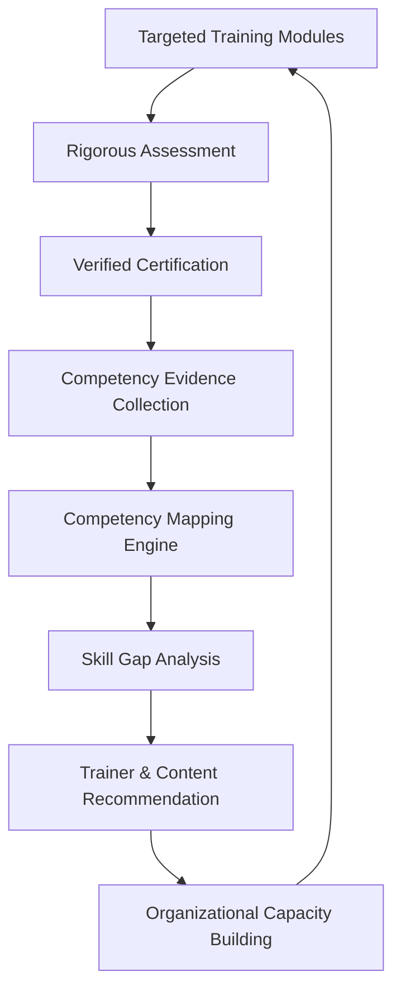

# CAPACITY CONNECT
## Digital Capacity Building and Learning Management Portal
### System Specification & Architectural Blueprint

---

## 1. Project Overview

**Capacity Connect** is an enterprise-grade digital capacity building and learning management platform engineered to bridge the gap between traditional learning management (LMS) and organizational human capital readiness.

Unlike generic course-delivery platforms that terminate upon course completion, Capacity Connect operates on a continuous, closed-loop organizational readiness lifecycle:



The system empowers institutions, enterprises, and public sector agencies to assess baseline workforce proficiencies, deploy targeted training interventions, rigorously evaluate outcomes through structured assessments, and quantify organizational capability through transparent readiness scoring.

---

## 2. Target Users

1. **Government & Public Sector Agencies**: Upskilling administrative, technical, and operational cadres with traceable competency milestones.
2. **Corporate Enterprises & Institutions**: Aligning team competencies with organizational strategy and digital transformation mandates.
3. **Training Providers & Domain Subject Matter Experts (SMEs)**: Delivering accredited curriculum, managing cohorts, and evaluating proficiency.
4. **Individual Trainees / Professionals**: Pursuing guided career pathways, self-paced upskilling, and verifiable certifications.

---

## 3. User Roles & Access Hierarchy

The portal enforces strict Role-Based Access Control (RBAC) across three primary actors:

| Role | Scope & Permissions | Core Responsibilities |
|---|---|---|
| **Trainee** | Self / Enrolled Cohorts | Course browsing, enrolling, accessing learning resources, taking MCQ & scenario assessments, viewing feedback, monitoring personal competency progress & radar charts, receiving personalized learning paths. |
| **Trainer** | Assigned Cohorts / Courses | Authoring course curricula and uploading resources, designing assessment banks (MCQs, rubrics), reviewing trainee submissions, providing actionable feedback, receiving AI/algorithmic teaching recommendations. |
| **Admin** | System-wide / Organization | Full platform governance, user lifecycle & role assignment, competency framework cataloging, taxonomy configuration, system-wide analytics, readiness auditing, organizational reporting. |

---

## 4. Official MVP Scope

The 16 core functional requirements mandated for the MVP are:

1. **Login & Registration**: Secure authentication with role-aware onboarding workflows.
2. **Role-Based Access Control (RBAC)**: Fine-grained permissions governing Trainee, Trainer, and Admin interactions.
3. **Trainee Profile Management**: Professional background, role tags, competency baseline, enrollment history, and progress trackers.
4. **Trainer Profile Management**: Expertise tags, qualifications, active course rosters, trainer ratings, and evaluation metrics.
5. **Course Management**: Structured courses, modular units, syllabus progression, multimedia resources, and enrollment controls.
6. **Learning Resources Module**: Centralized repository of documents, slides, videos, and reference guides (backed by object storage).
7. **MCQ Assessment System**: Timed examinations, randomized question pools, automated grading, instant score breakdown.
8. **Feedback System**: Trainee-to-course evaluations, trainer commentary on trainee milestones, and satisfaction metrics.
9. **Admin Dashboard**: System health, active users, enrollment velocity, platform completion rates, and organizational KPIs.
10. **Notifications Module**: In-app notifications and email alerts for upcoming deadlines, assessment releases, and certificates.
11. **Competency Mapping Engine**: Multi-dimensional tagging of courses and assessments to organizational skill frameworks.
12. **Trainer Recommendation Engine**: Algorithmic pairing of qualified trainers with emerging institutional skill deficits.
13. **Skill Gap Analysis**: Matrix comparing required organizational competencies against evaluated cohort performance.
14. **Personalized Learning Path**: Adaptive curriculum suggestions addressing individual deficit areas.
15. **Competency / Readiness Score**: Standardized mathematical formulation calculating holistic trainee and organizational readiness.
16. **Analytics Dashboard**: Multi-tier visual reporting for executives, trainers, and trainees.

---

## 5. Technology Stack

### Frontend Architecture
- **Framework**: React 19+ with TypeScript
- **Build Tool**: Vite (optimized HMR, esbuild bundling)
- **Styling**: Tailwind CSS with custom enterprise design system
- **UI Primitives**: shadcn/ui pattern (Radix UI primitives, Lucide icons, accessible ARIA compliant components)
- **State Management**: Zustand (lightweight client state for user sessions, notifications, UI modes)
- **Server Cache & Async State**: TanStack Query v5 (React Query) for optimistic updates, caching, and background sync
- **Routing**: React Router v7 with protected routes and role-based guards
- **Data Visualization (Future)**: Recharts, D3.js, Three.js

### Backend Architecture
- **Language**: Python 3.12+ / 3.14 compatible
- **API Framework**: FastAPI (high-performance asynchronous ASGI, automated OpenAPI/Swagger documentation)
- **Data Validation & Settings**: Pydantic v2 & Pydantic-Settings
- **ORM / Database Layer**: SQLAlchemy 2.0 (declarative mapping, connection pooling, async-capable)
- **Database Migrations**: Alembic
- **Testing**: Pytest with HTTPX test client

### Database & Storage Architecture
- **Primary Database**: PostgreSQL 16+ (structured relational schema with JSONB support for dynamic rubric definitions)
- **Cloud Database Compatibility**: Fully compatible with Supabase PostgreSQL
- **Object Storage (Future)**: Supabase Storage / S3-compatible API for learning assets, profile pictures, and generated PDF certificates

### Infrastructure & DevOps
- **Containerization**: Docker & Docker Compose for reproducible local environments
- **Version Control**: Git / GitHub with conventional commit practices

---

## 6. High-Level Architecture

```
                          ┌───────────────────────────┐
                          │    Browser Client         │
                          │ React + Vite + Tailwind   │
                          │ Zustand + TanStack Query  │
                          └─────────────┬─────────────┘
                                        │ HTTPS / JSON REST
                                        ▼
                          ┌───────────────────────────┐
                          │    FastAPI Gateway        │
                          │      /api/v1/...          │
                          └──────┬─────────────┬──────┘
                                 │             │
                ┌────────────────┴────┐   ┌────┴────────────────┐
                │ Core Services       │   │ Intelligence Engine │
                │ - Auth & RBAC       │   │ - Competency Mapper │
                │ - Courses & Content │   │ - Gap Analyzer      │
                │ - Assessments       │   │ - Recommendation    │
                └─────────┬───────────┘   └──────────┬──────────┘
                          │                          │
                          └─────────────┬────────────┘
                                        │ SQLAlchemy ORM
                                        ▼
                          ┌───────────────────────────┐
                          │   PostgreSQL Database     │
                          │   (Local / Supabase)      │
                          └───────────────────────────┘
```

---

## 7. Development Phases

- **Phase 0 (Complete)**: Project Foundation & Architecture Setup (monorepo directory layout, frontend shell, backend skeleton, database session manager & migrations foundation, health endpoints, CI/CD and Docker presets).
- **Phase 1 (Complete)**: Database Schema Modeling & Alembic Migrations (29 normalized domain entities across Organization, Users, Courses, Assessments, Feedback, Competencies, and Subject Requirements; UUID primary keys; Alembic revision 0001; validated on PostgreSQL; see `docs/DATABASE_SCHEMA.md`).
- **Phase 2 (Complete)**: Authentication, Security & Role-Based Access Control (RBAC) (Argon2id password hashing, JWT access & refresh token rotation with `auth_sessions` table, account status lifecycle [PENDING, ACTIVE, SUSPENDED, REJECTED], public admin registration lockdown, email verification tokens, forgot/reset password flows, FastAPI RBAC dependencies [`get_current_user`, `require_role`], admin user approval endpoints, React + Zustand frontend authentication flows with Framer Motion, 100% ₹0-cost open-source stack; see `docs/AUTHENTICATION_SECURITY.md`).
- **Phase 3**: Trainee, Trainer & Admin Profile Management.
- **Phase 4**: Course Catalog & Learning Resource Management (file upload integration).
- **Phase 5**: Assessment Engine & Automated Evaluation.
- **Phase 6**: Competency Framework & Evidence Engine.
- **Phase 7**: Skill Gap Analysis & Recommendation Engine.
- **Phase 8**: Analytics Dashboards & Reporting.
- **Phase 9**: Quality Assurance, End-to-End Testing & Production Deployment.

---

## 8. Coding Conventions

### Backend (Python / FastAPI)
- Strict PEP 8 standards with type hinting on all functions and routes.
- Layered separation of concerns:
  - `routers/`: Pure routing, HTTP status codes, request/response serialization.
  - `services/`: Core business logic, orchestration, algorithms.
  - `models/`: SQLAlchemy ORM database models.
  - `schemas/`: Pydantic input validation and output serialization contracts.
  - `database/`: Engine, session factories, and base declarative classes.
  - `core/`: Application settings, security utilities, and constants.
- Never write raw SQL in routers; access data via SQLAlchemy sessions through service abstractions.

### Frontend (React / TypeScript)
- Functional components exclusively with typed interfaces (`props: ComponentProps`).
- Strict TypeScript (`noImplicitAny`, proper typing of API responses).
- Component-driven architecture using atomic design principles:
  - `components/ui/`: Base design primitives (Button, Card, Input, Modal).
  - `components/layout/`: AppShell, Header, Sidebar, Footer.
  - `pages/`: Page-level route views.
  - `services/api/`: Typed HTTP fetchers communicating with backend endpoints.
  - `store/`: Zustand stores for global UI and auth session states.
- Semantic HTML and full keyboard accessibility (ARIA compliance).

---

## 9. Security Principles

1. **Zero Secret Leaks**: No API keys, database credentials, or secret salts in source control. Everything loaded via environment variables (`.env`).
2. **Defensive API Design**: Validate all input payloads through Pydantic models. Sanitize text against XSS.
3. **Password Security**: Passwords hashed using Argon2id or bcrypt with strong work factors.
4. **Stateless JWT Authorization**: Short-lived access tokens with secure token rotation.
5. **Least Privilege Principle**: Endpoints protected by declarative role dependencies (`require_role("admin")`).
6. **CORS Governance**: Restrict allowed origins to explicitly declared frontend hosts.

---

## 10. Important Implementation Rules

- **Incremental Phasing**: Never jump ahead to implement modules planned for future phases.
- **Verification First**: Every service and endpoint must be validated with tests or live invocations before closing a phase.
- **Deterministic Migrations**: All database schema changes must be driven through versioned Alembic revisions.
- **Preserve System Boundaries**: Maintain clear abstraction boundaries between database models, business services, and public API schemas.

---

## 11. Phase Progress & Roadmap Status

| Phase | Description | Status | Validation |
| :--- | :--- | :--- | :--- |
| **Phase 0** | System Architecture & Foundations | **COMPLETE** | FastAPI + Vite Dockerized, Health Endpoints Verified |
| **Phase 1** | Database Schema & Core Data Models | **COMPLETE** | 31 Tables, UUID Primary Keys, Timestamp Mixins, Alembic Head |
| **Phase 2** | Authentication, Security & RBAC | **COMPLETE** | Argon2id, JWT Tokens, Verification & Reset Flows, Role Guard |
| **Phase 3** | Core Platform UI & Trainee Experience | **COMPLETE** | Dashboard, Profile, Courses Catalogue, Details, Enrollment, Syllabus, Real-time Progress (48 backend tests, 16 vitest tests) |
| **Phase 4** | Trainer + Admin Portals + Assessment Engine | **COMPLETE** | Full MCQ Engine (deterministic grading, attempt tracking, sanitized question retrieval), Trainer Portal (KPIs, Course/Syllabus Authoring, Question Builder, Cohort Performance), Admin Portal (System Telemetry, User Governance with Self-Protection, Course Moderation, Exam Integrity), In-App Notifications, Role-based Routing (67 backend tests, 26 vitest tests) |
| **Phase 5** | Competency Universe & 3D Visualization | *Upcoming* | Interactive Three.js / React Three Fiber Constellations |
