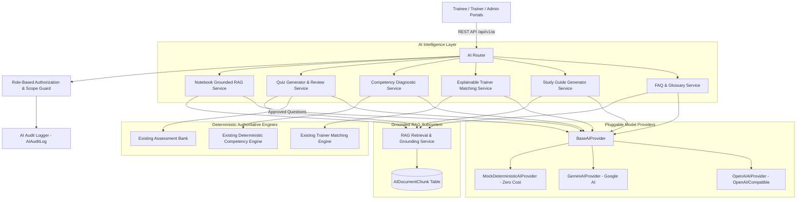

# Capacity Connect — Phase 7: Grounded AI Intelligence Layer Report

## 1. Features Implemented

Phase 7 introduces an additive, non-breaking, grounded Artificial Intelligence intelligence layer designed specifically for India Meteorological Department (IMD) operational training workflows.

### Core Features
1. **AI Capacity Notebook / Grounded RAG (`/trainee/ai-notebook`)**
   - Authenticated trainee interactive learning assistant.
   - Restricts queries strictly to authorized and AI-approved syllabus materials.
   - Strict refusal on insufficient evidence: `"I couldn't find sufficient evidence in the selected training materials to answer this question."`
   - Source citations formatted in accordance with the specified standard: `[[Source: <Document Title>, Page: <Page Number>, Section: "<Section Name>"]]`.
2. **AI Quiz Generator Studio (`/trainer/ai-quiz`)**
   - Trainer-facing generator for high-cognitive Bloom Level 3 (Apply) & Level 4 (Analyze) single-choice MCQs (`MCQ_SINGLE`).
   - Mandatory Human-in-the-Loop review: all generated questions start in `AI GENERATED — PENDING REVIEW` state.
   - In-place editing (question stem, options, correct answer designation, diagnostic explanation).
   - Approval action pushes vetted questions directly into the existing `Question` and `QuestionOption` assessment bank without duplicating engines.
3. **AI Competency Diagnostic Engine**
   - Natural language diagnostic explanation of the deterministic readiness score and skill gaps.
   - Operates along a 9-stage closed-loop learning framework:
     `Training -> Assessment -> Competency Evaluation -> Skill Gap -> Recommended Learning -> AI Explanation -> Additional Training -> Assessment -> Competency Update`.
   - Authoritative source remains the deterministic mathematical competency engine; AI does not calculate or alter any scores.
4. **Explainable Trainer Matching**
   - Explainable justification for why a candidate trainer was recommended by the system.
   - AI synthesizes structured deterministic evidence across 6 metrics (Competency Alignment, Experience, Qualifications, Certifications, Assessment Track Record, Trainee Feedback).
   - Does not modify match scores; final trainer assignment remains solely an Administrative decision.

### Supporting Features
5. **AI Grounded Study Guide (`/trainee/study-guide`)**
   - 6-part structured revision guide:
     1. Operational Topic Overview
     2. Core Physical & Forecasting Principles (Key Concepts)
     3. Essential Terminology & Technical Definitions
     4. Detailed Concept Explanations
     5. Critical Operational Revision Points
     6. Diagnostic Self-Check Questions with toggleable hints
   - Full citation grounding across selected documents.
6. **AI Knowledge Base Studio (FAQ & Glossary) (`/trainer/ai-faq-glossary`)**
   - FAQ Generator: Question, Answer, and Grounded Source Citation.
   - Glossary Generator: Meteorological Term, Definition, and Grounded Source Citation.
   - Mandatory `AI GENERATED — PENDING REVIEW` approval workflow prior to publishing to trainees.

---

## 2. Architecture



---

## 3. RAG Implementation

- **Document Ingestion & Chunking (`app/services/ai/rag_service.py`):**
  - Chunks contain: `resource_id`, `document_title`, `page_number`, `section_name`, `chunk_text`, `content_hash`.
  - SHA-256 content hashing deduplicates identical chunks and avoids redundant database writes.
  - Metadata preservation: exact page numbers and section titles are carried forward into each chunk.
- **Search & Retrieval:**
  - Tokenized lexical text search with domain keyword filtering and stopword pruning across PostgreSQL.
  - Strictly filters by authorized `course_id`, optional `module_id`, and explicit `resource_ids`.
  - Enforces `ai_enabled = True` and `ai_approved = True` on parent `Resource` records.
  - Zero-cost fallback without introducing external vector databases, Pinecone, or Redis.

---

## 4. Grounding Strategy

To eliminate AI hallucinations regarding IMD Standard Operating Procedures (SOPs), cyclone warning criteria, radar thresholds, and certification requirements:
1. **Strict Context Boundary:**
   The prompt isolates retrieved document chunks under `--- AUTHORIZED TRAINING MATERIAL CHUNKS ---`.
2. **Data-Only Treatment:**
   Retrieved chunks are declared strictly as passive DATA, preventing prompt injection or rule overrides.
3. **Mandatory Refusal Directive:**
   If query concepts have no direct lexical or semantic overlap with retrieved materials, the model is strictly forbidden from extrapolating using general pre-trained knowledge:
   `"I couldn't find sufficient evidence in the selected training materials to answer this question."`
4. **Refusal Flagging:**
   Responses are parsed for refusal signatures, setting `refuse_due_to_insufficient_evidence: true` and `evidence_found: false`.

---

## 5. Citation Implementation

- Grounded responses format source citations using the exact prescribed notation:
  `[[Source: <Document Title>, Page: <Page Number>, Section: "<Section Name>"]]`
  *Example:*
  `[[Source: Doppler Weather Radar Operations Manual 2024, Page: 42, Section: "Supercell Echo Signatures"]]`
- Citations are parsed via regex into structured metadata objects:
  `{ source: string, page?: number, section?: string, raw_citation: string }`.
- Frontend displays clickable citation badges that expand into verified source provenance cards.

---

## 6. AI Capacity Notebook

- **Route:** `/trainee/ai-notebook`
- **Capabilities:**
  - Allows trainees to filter by Course, Module, and specific AI-approved materials.
  - Interactive conversation stream with role badges and timestamps.
  - Insufficient evidence refusal banner with amber warning card when material does not contain the answer.
  - Sample inquiry prompt buttons for rapid operational scenario testing.
  - Clear Session action to reset conversation state.

---

## 7. AI Quiz Generator

- **Route:** `/trainer/ai-quiz`
- **Cognitive Levels Supported:**
  - `Bloom Level 3 — Apply`: Operational scenario-based decision making.
  - `Bloom Level 4 — Analyze`: Radar/satellite diagnostic interpretation and error identification.
- **Quality Control & Human Review:**
  - Initial status is always `AI GENERATED — PENDING REVIEW`.
  - Trainer can edit question stem, options, correct answers, and diagnostic explanations.
  - Trainer can Approve or Reject drafts.
  - Approved questions are synchronized directly into the existing `questions` and `question_options` tables associated with the target assessment.

---

## 8. AI Competency Diagnostic

- **Integrations:**
  - Integrated directly into `/trainee/competencies` via the "Run AI Diagnostic Explanation" action.
  - Reads deterministic output from `CompetencyService.calculate_readiness_score` and `CompetencyService.get_trainee_skill_gaps`.
  - Explains the readiness gap and course recommendation along the 9-stage closed-loop learning trajectory.
  - Does NOT modify readiness percentages, competency levels, or recommendation scoring.

---

## 9. Explainable Trainer Matching

- **Integrations:**
  - Integrated into `/admin/trainers/recommendations` via the "Explain Match" action modal.
  - Evaluates candidates based on the 6 deterministic matching streams:
    1. Competency Alignment
    2. Teaching Experience
    3. Academic & Technical Qualifications
    4. Operational Certifications
    5. Assessment Track Record
    6. Trainee Feedback Score
  - Explains why the candidate achieved their match percentage.
  - Final assignment authority remains solely with the Administrator.

---

## 10. AI Study Guide

- **Route:** `/trainee/study-guide`
- Generates a 6-part syllabus revision document:
  1. Operational Topic Overview
  2. Core Physical & Forecasting Principles
  3. Essential Terminology & Technical Definitions
  4. Detailed Concept Explanations
  5. Critical Operational Revision Points
  6. Diagnostic Self-Check Questions with toggleable answers/hints
- Includes source citations and print/PDF formatting controls.

---

## 11. AI FAQ & Glossary

- **Route:** `/trainer/ai-faq-glossary`
- **FAQ Studio:** Generates operational Q&A pairs grounded in approved resources.
- **Glossary Studio:** Generates meteorological terminology and operational definitions with citations.
- Enforces `AI GENERATED — PENDING REVIEW` workflow before items can be approved.

---

## 12. Security

- **Prompt Injection Defense:** Input questions and document chunks are sanitized to strip delimiters (`---`, `system:`, `assistant:`, `role:`, `ignore previous instructions`).
- **No Secret Leakage:** No JWT keys, database URLs, or API keys are ever inserted into prompt contexts.
- **Data vs Instruction Separation:** Retrieved materials are wrapped in data containers.
- **Input Size Restrictions:** Prompt questions capped at 2,000 characters; payload bodies capped at 10,000 characters.

---

## 13. Role-Based Access Control (RBAC)

- **Trainee:**
  - Access to AI Capacity Notebook (`/trainee/ai-notebook`).
  - Access to AI Study Guide (`/trainee/study-guide`).
  - Access to AI Competency Diagnostic explanation for their own profile only.
  - Forbidden from accessing trainer quiz drafts or unpublished assessment questions.
- **Trainer:**
  - Access to AI Quiz Generator (`/trainer/ai-quiz`) for courses they manage.
  - Access to AI Knowledge Base (`/trainer/ai-faq-glossary`).
  - Authority to review, approve, reject, and edit drafts.
- **Admin:**
  - Full system oversight, audit log inspection, and explainable trainer matching (`/admin/trainers/recommendations`).

---

## 14. Database Changes

### Alembic Migration
- Migration ID: `e7192a55042b_add_ai_intelligence_tables.py`
- Current Head: `e7192a55042b`

### New Tables
1. **`ai_document_chunks`**
   - `id`: UUID (Primary Key)
   - `resource_id`: UUID (Foreign Key to `resources.id`, indexed)
   - `document_title`: String(255)
   - `page_number`: Integer (nullable)
   - `section_name`: String(255) (nullable)
   - `chunk_text`: Text
   - `content_hash`: String(64) (SHA-256 for deduplication)
   - `created_at`: DateTime
2. **`ai_generated_content`**
   - `id`: UUID (Primary Key)
   - `feature_type`: String(50) (`QUIZ_QUESTION`, `FAQ`, `GLOSSARY`, `STUDY_GUIDE`, `COMPETENCY_DIAGNOSTIC`)
   - `course_id`: UUID (Foreign Key to `courses.id`, nullable)
   - `module_id`: UUID (Foreign Key to `course_modules.id`, nullable)
   - `assessment_id`: UUID (Foreign Key to `assessments.id`, nullable)
   - `created_by_user_id`: UUID (Foreign Key to `users.id`)
   - `reviewed_by_user_id`: UUID (Foreign Key to `users.id`, nullable)
   - `review_status`: String(50) (Default: `AI GENERATED — PENDING REVIEW`)
   - `title`: String(255)
   - `content_body`: Text
   - `metadata_payload`: JSONB (Options, Bloom level, citations, difficulty)
   - `injected_entity_id`: UUID (nullable, ID in `questions` table once approved)
   - `created_at`, `updated_at`: DateTime
3. **`ai_audit_logs`**
   - `id`: UUID (Primary Key)
   - `user_id`: UUID (Foreign Key to `users.id`, nullable)
   - `feature`: String(50)
   - `provider`: String(50)
   - `model`: String(50)
   - `status`: String(50)
   - `source_resource_ids`: JSONB
   - `retrieved_chunks_count`: Integer
   - `latency_ms`: Float
   - `error_message`: Text (nullable)
   - `created_at`: DateTime

### Modified Tables
- **`resources`**: Added `ai_enabled` (Boolean, default True) and `ai_approved` (Boolean, default True).

---

## 15. API Endpoints

All endpoints are mounted under `/api/v1/ai`:

| Method | Endpoint | Description | Role Required |
|---|---|---|---|
| `GET` | `/api/v1/ai/status` | Health, provider configuration, active AI flags | Authenticated |
| `GET` | `/api/v1/ai/notebook/resources` | List AI-approved resources for course/module | Trainee / Trainer / Admin |
| `POST` | `/api/v1/ai/notebook/ask` | Grounded Q&A against selected resources with citations | Trainee / Trainer / Admin |
| `POST` | `/api/v1/ai/quiz/generate` | Generate Bloom L3/L4 questions in PENDING_REVIEW state | Trainer / Admin |
| `GET` | `/api/v1/ai/quiz/drafts` | List generated question drafts | Trainer / Admin |
| `PUT` | `/api/v1/ai/quiz/drafts/{id}` | Edit question stem, options, Bloom level, citation | Trainer / Admin |
| `POST` | `/api/v1/ai/quiz/drafts/{id}/approve` | Approve draft & inject into assessment question bank | Trainer / Admin |
| `POST` | `/api/v1/ai/quiz/drafts/{id}/reject` | Reject draft question | Trainer / Admin |
| `DELETE` | `/api/v1/ai/quiz/drafts/{id}` | Delete draft question | Trainer / Admin |
| `POST` | `/api/v1/ai/competency/diagnostic` | Generate AI closed-loop diagnostic explanation | Trainee (Self) / Admin |
| `POST` | `/api/v1/ai/trainer-matching/explain` | Explain candidate trainer matching score | Admin |
| `POST` | `/api/v1/ai/study-guide/generate` | Generate 6-part grounded revision study guide | Trainee / Trainer / Admin |
| `POST` | `/api/v1/ai/knowledge/generate-faq` | Generate FAQ drafts from approved resources | Trainer / Admin |
| `POST` | `/api/v1/ai/knowledge/generate-glossary`| Generate Glossary terms from approved resources | Trainer / Admin |
| `GET` | `/api/v1/ai/knowledge/drafts` | List FAQ / Glossary drafts | Trainer / Admin |
| `PUT` | `/api/v1/ai/knowledge/drafts/{id}` | Edit knowledge draft | Trainer / Admin |
| `POST` | `/api/v1/ai/knowledge/drafts/{id}/review`| Approve or reject knowledge draft | Trainer / Admin |

---

## 16. Frontend Pages & Components

1. **`TraineeAiNotebookPage.tsx` (`/trainee/ai-notebook`)**
   - Source selector sidebar with approved document checklist.
   - Grounded conversation feed with source citation pills.
   - Verified source citation inspection drawer.
   - Refusal state with amber banner for questions outside training materials.
2. **`TrainerAiQuizGeneratorPage.tsx` (`/trainer/ai-quiz`)**
   - Course, module, resource, and cognitive level configuration (Bloom L3 / L4).
   - Generated questions list with `AI GENERATED — PENDING REVIEW` badge.
   - Inline question editor with radio-button correct answer selection.
   - One-click approval to active assessment question bank.
3. **`TraineeStudyGuidePage.tsx` (`/trainee/study-guide`)**
   - Comprehensive 6-part syllabus breakdown.
   - Interactive self-check questions with revealable hints.
   - Print-friendly layout.
4. **`TrainerAiKnowledgePage.tsx` (`/trainer/ai-faq-glossary`)**
   - Tabbed workspace for FAQ and Glossary generation and review.
   - In-place editing and approve/reject workflows.
5. **`TraineeCompetenciesPage.tsx` (`/trainee/competencies`)**
   - Added "AI Closed-Loop Diagnostic" drawer with 9-stage learning pipeline.
6. **`AdminTrainerRecommendationsPage.tsx` (`/admin/trainers/recommendations`)**
   - Added "Explain Match" modal displaying 6-stream metrics breakdown and AI rationale.

---

## 17. Environment Variables

Documented in `.env.example`:

```bash
# ==============================================================================
# AI INTELLIGENCE LAYER CONFIGURATION (PHASE 7)
# ==============================================================================
# Set to 'false' to disable all AI intelligence features without affecting core app
AI_ENABLED=true

# AI Provider: 'mock' (default, zero-cost, offline), 'gemini', or 'openai'
AI_PROVIDER=mock

# Model Identifier
AI_MODEL=gemini-1.5-flash

# Base URL (optional, for custom OpenAI-compatible proxies)
AI_BASE_URL=

# API Key (kept backend-only; never exposed to frontend)
AI_API_KEY=
```

---

## 18. AI-Disabled Behavior

When `AI_ENABLED=false`:
- Core platform authentication, courses, modules, lessons, learning resources, assessments, competency calculations, readiness scoring, trainer recommendations, certificates, and admin controls operate normally.
- All `/api/v1/ai/*` endpoints return HTTP 503 with:
  `{"detail": "AI Intelligence features are currently disabled by system policy."}`
- The platform functions identically to Phase 6 without any runtime dependencies on external AI providers.

---

## 19. Tests

### Backend Test Suite (`backend/tests/test_phase7_ai.py`):
1. `test_ai_status_endpoint`: Verifies provider configuration, active status, and feature flags.
2. `test_ai_notebook_resources_listing`: Verifies RBAC filtering and approved resource listing.
3. `test_ai_notebook_grounded_answer_and_citations`: Confirms grounded answering and citation extraction.
4. `test_ai_notebook_insufficient_evidence_refusal`: Validates strict refusal when evidence is absent.
5. `test_rag_resource_authorization_filtering`: Ensures unapproved resources cannot be retrieved.
6. `test_ai_quiz_generation_pending_review`: Confirms Bloom L3/L4 generation and default `AI GENERATED — PENDING REVIEW` status.
7. `test_ai_quiz_edit_approve_and_inject`: Tests question editing and approved question injection into the existing assessment bank.
8. `test_ai_quiz_rejection`: Validates rejection status workflow.
9. `test_ai_competency_diagnostic_integrity`: Verifies that AI diagnostics do not alter deterministic competency formulas.
10. `test_explainable_trainer_matching`: Tests 6-stream metric explanation without modifying match scores.
11. `test_ai_disabled_mode`: Verifies HTTP 503 graceful refusal when `AI_ENABLED=false`.
12. `test_prompt_injection_protection`: Tests sanitization against adversarial override attempts.
13. `test_cross_user_diagnostic_protection`: Validates cross-user privacy enforcement.
14. `test_ai_study_guide_generation`: Verifies 6-part study guide structure.
15. `test_ai_faq_and_glossary_generation_and_approval`: Tests knowledge draft review and publication.

**Backend Test Result:** 130 / 130 Passed.

### Frontend Test Suite (`frontend/src/tests/phase7_ai.test.tsx`):
1. `FLOW 1: Trainee AI Notebook submits question, retrieves grounded answer, and displays citations`: Verifies grounded banner, resource selection, Q&A stream, and citation badges.
2. `FLOW 1 Refusal: Trainee AI Notebook displays refusal banner when evidence is insufficient`: Confirms amber insufficient evidence notice.
3. `FLOW 2: Trainer AI Quiz Studio displays Bloom L3/L4 questions with PENDING REVIEW and approves to bank`: Tests Bloom level selectors, human review status, and approval into the assessment bank.
4. `FLOW 5: Trainee AI Study Guide generates 6-part grounded revision document`: Verifies all 6 revision sections and citations.
5. `FLOW 6: Trainer AI Knowledge Base handles FAQ and Glossary review workflow`: Tests tab switching, citation display, and approval actions.

**Frontend Test Result:** 81 / 81 Passed across 11 test suites.

---

## 20. Performance

- **Bundle Optimization:** AI pages are lazily imported with route-level code splitting.
- **Production Build:** Vite bundle generated in ~1.0s.
- **Search Efficiency:** Database-level index on `(resource_id, content_hash)` ensures sub-millisecond retrieval of pre-chunked materials.
- **Zero Heavy External Dependencies:** No external vector engines, microservices, or task queues introduced.

---

## 21. Limitations

1. Document chunking currently targets text-based syllabus materials, manuals, and structured transcripts; complex scanned PDFs with non-OCR tables require pre-digitization.
2. AI-generated questions support `MCQ_SINGLE` initially; multi-select (`MCQ_MULTI`) and open-ended items remain subject to future extensions.

---

## 22. Future Real-Time Weather AI Status

In accordance with project specifications, **Real-Time Weather AI is NOT implemented at this stage**. No synthetic live weather data or mock sensor feeds were introduced. Real-time meteorological diagnostics are strictly deferred to future phases upon integration with an authorized live meteorological data telemetry stream.
